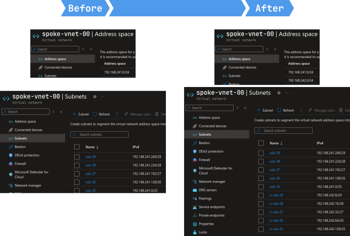

# Copy-AzSubnets


## Introduction

This script is designed to automate the cloning of subnets within an Azure Virtual Network (VNet). This tool is particularly useful when extending a VNet with a new address space while preserving the structure of existing subnets.

## Overview

This tool is ideal for scenarios where you need to scale your Azure infrastructure quickly and maintain consistency across your networking configurations. Instead of manually configuring new subnets, the script does the work for you by replicating existing subnet structures, adding new address spaces, and updating VNet properties automatically. 

## Installation

To install the script, run the following command:

```powershell
Install-Script -Name Copy-AzSubnets -Force
```

### Input Parameters
- **`vnet_id`**(Required): The ID of the Azure Virtual Network.
- **`new_address_space`**(Required): The new IP address space to be used for subnet creation.
- **`new_subnet_prefix`** (Optional): The prefix for new subnet names (default is `n-`).

### Example
```powershell
Copy-AzSubnets.ps1 -vnet_id "/subscriptions/<subscription-id>/resourceGroups/<resource-group>/providers/Microsoft.Network/virtualNetworks/<vnet-name>" -new_address_space "<cidr-ip>"
```

```powershell
Copy-AzSubnets.ps1 -vnet_id "<vnet-id>" -new_address_space "192.168.242.0/24"
```

