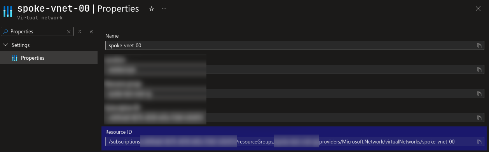

# Copy-AzSubnets


## Introduction

This script is designed to automate the cloning of subnets within an Azure Virtual Network (VNet). This tool is particularly useful when extending a VNet with a new address space while preserving the structure of existing subnets.

## Overview

This tool is ideal for scenarios where you need to scale your Azure infrastructure quickly and maintain consistency across your networking configurations. Instead of manually configuring new subnets, the script does the work for you by replicating existing subnet structures, adding new address spaces, and updating VNet properties automatically. 

## How-to use

1. Install the script:

```powershell
Install-Script -Name Copy-AzSubnets -Force
```

2. Apply the changes:

```powershell
Copy-AzSubnets.ps1 -vnet_id "<vnet-id>" -new_address_space "<new-ip>"
```

### Input Parameters
- **`vnet_id`**(Required): The ID of the Azure Virtual Network.
- **`new_address_space`**(Required): The new IP address space to be used for subnet creation.
- **`new_subnet_prefix`** (Optional): The prefix for new subnet names (default is `n-`).

### Example

Let's say, there is a following VNet:


To run the script you'll need to get VNet ID (VNet -> Settings -> Properties):



After VNet ID is known and new IP address has been chosen, you can install and run the script:


As a result subnet structure will be copied (blue color - original IPs, green - copied):

